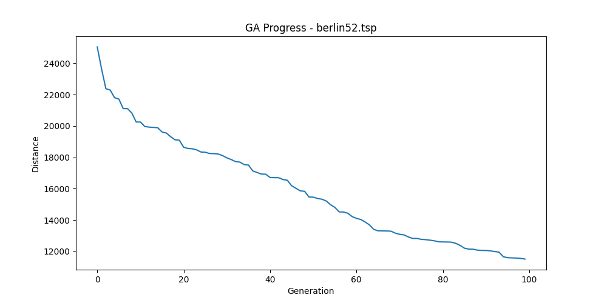

# Genetic Algorithms: Improving Convergence with 2-opt Local Search

In evolutionary computation, Genetic Algorithms (GA) are excellent for global search (exploration) but often struggle to find the precise global optimum, getting trapped in local optima. In my recent optimization project, I improved convergence speed by hybridizing GA with **2-opt Local Search**.

### 1. The Problem
Relying solely on standard genetic operators creates two main issues in large search spaces (like TSP):
1.  **Slow Convergence:** The algorithm may spend too many generations trying to fine-tune a "good" solution using random mutations.
2.  **Local Optima:** Pure GA is great at finding promising regions but lacks the deterministic power to climb to the absolute peak of that region (Exploitation).

### 2. The Solution: Hybrid (Memetic) Approach
I implemented a hybrid structure where the GA handles the global search, and a Local Search algorithm (2-opt) refines the results. Crucially, to save computational power, I apply 2-opt **only to the elite individual** of each generation.

```python
def hybrid_genetic_algorithm(population):
    for generation in range(MAX_GENERATIONS):
        # 1. Standard GA Steps (Exploration)
        parents = selection(population)
        offspring = crossover(parents)
        offspring = mutation(offspring)
        
        # 2. Evaluate Fitness
        evaluate_fitness(offspring)
        
        # 3. Hybrid Step: Local Search (Exploitation)
        # Apply 2-opt only to the best candidate to save resources
        best_candidate = get_best_individual(offspring)
        optimized_candidate = apply_2opt_local_search(best_candidate)
        
        # 4. Update Population (Elitism)
        # Replace the worst individual with the locally optimized one
        replace_worst(offspring, optimized_candidate)
        
        population = offspring
```

### 3. Visual Evidence
The graph below demonstrates the convergence of the Hybrid Genetic Algorithm on the `berlin52` TSP instance. The sharp initial drop indicates effective exploration, while the continuous decline shows how the local search (2-opt) successfully refines the solution towards the optimum generation by generation.



### 4. Key Benefits
* **Exploration vs. Exploitation:** Balances the GA's ability to scan the whole search space with 2-opt's ability to hill-climb local peaks.
* **Convergence Speed:** Drastically reduces the number of generations needed to reach an acceptable solution.
* **Efficiency:** By targeting only the elite individual, we get the benefits of local search without the heavy computational cost of running it on the entire population.
