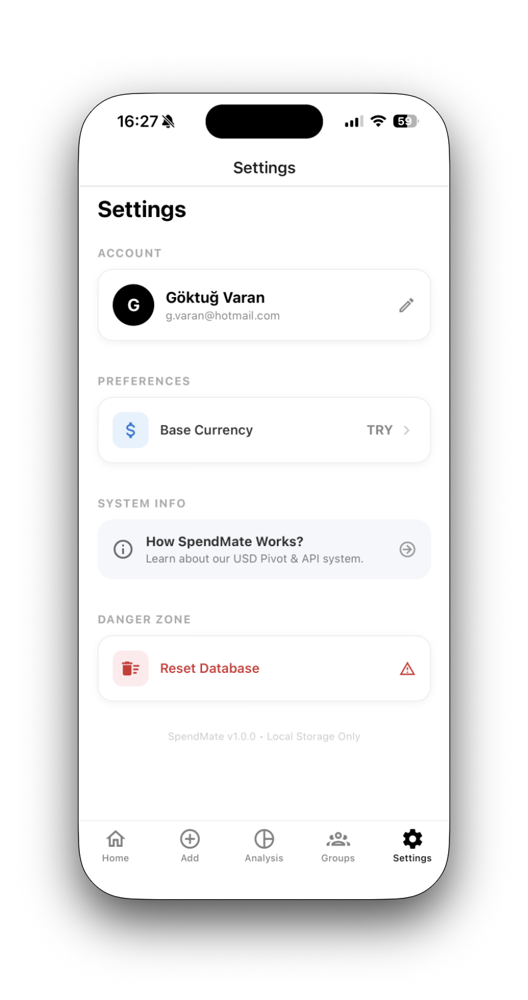
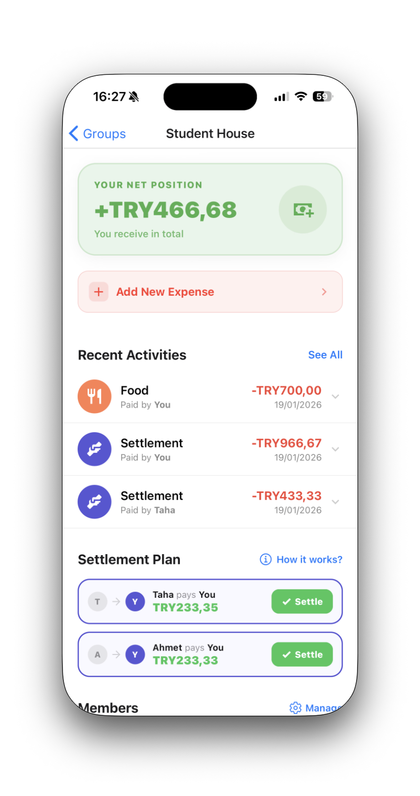
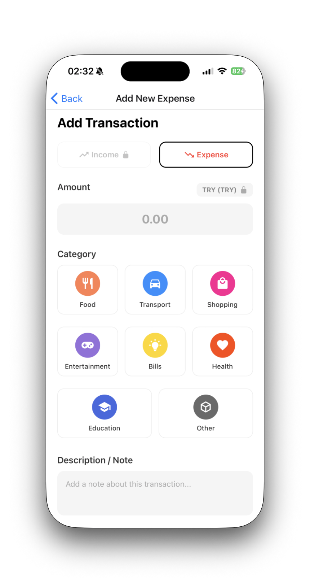
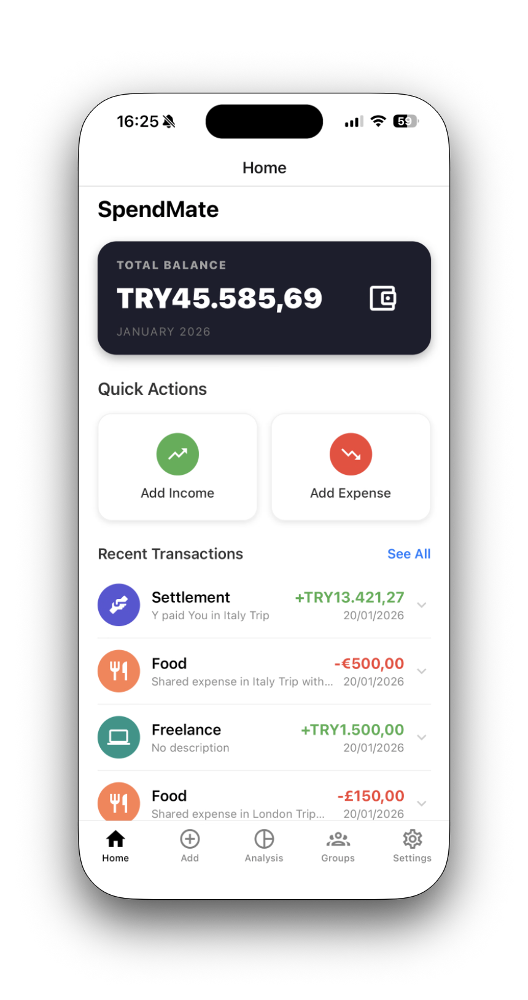
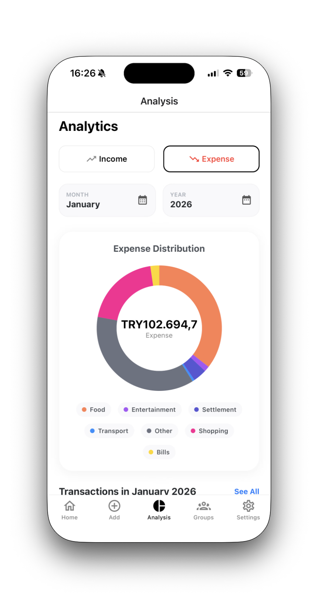

# SpendMate: Relational Persistence and UX Challenges in Finance Apps

SpendMate is a personal and group expense tracker focused on financial accuracy and seamless debt management. Developing this project involved solving complex relational data problems and implementing a reference-based currency architecture.

  
   
  <em>SpendMate: Smart and Minimalistic Finance Management.</em>

### 1. The Challenge: Financial Accuracy & Currency Volatility
In a finance app, exchange rates fluctuate daily. Storing a transaction only in a local currency (e.g., "100 TRY") creates an issue: its relative value in a "Total Balance" will change retroactively as rates move.

**The Solution: The USD Pivot System**
I implemented a reference-based architecture where every transaction, regardless of its original currency, is converted to its **USD equivalent at the exact moment of entry** using the **Frankfurter API** and stored as a `base_amount`.

* **Data Reliability:** Exchange rate data is provided by the **Frankfurter API** ([lineofflight/frankfurter](https://github.com/lineofflight/frankfurter)), which utilizes open data published by the **European Central Bank**.
* **Rationale:** This preserves the historical value. If a user changes their base currency later (via the Settings), the app recalculates totals from the fixed USD reference, preventing "phantom" wealth changes.

  
   
  <em>Settings screen where users can define their base currency and manage local data.</em>

### 2. Relational Persistence with SQLite
Unlike simple apps using `AsyncStorage`, SpendMate requires complex relational logic to handle **Groups, Members, Transactions, and Splits**.

* **Schema Design:** Utilized `expo-sqlite` to manage a relational schema.
* **Debt Simplification:** The system processes relational splits to calculate exactly "who owes whom" in group activities.

  
   
  <em>Group detail view showing the calculated settlement plan and "who owes whom" logic.</em>

### 3. Navigation & Contextual UX Constraints
A major challenge was the **Nested Page Flow**. When adding an expense from within a group, the app must prevent data inconsistency.

**The Solution: Locked State & UI Isolation**
* **Feature Locking:** The Group Selector and Type Toggle (Income/Expense) are disabled when navigated from a group context.
* **UI Focus:** The Bottom Tab Navigator is hidden to force a focused transactional flow.

  
   
  <em>Context-aware transaction entry screen with locked group selection for data integrity.</em>

### 4. Smart Keyboard Handling
On the "Add Transaction" screen, multiline note inputs often obstructed the primary action button.

**The Solution: Sticky Action Buttons**
Using `KeyboardAvoidingView` with a calculated `keyboardVerticalOffset`, I ensured the "Add" button remains visible above the keyboard at all times.

### 5. Final Interface & Analytics
The result features high-contrast donut charts for expense distribution and independent accordion states for history.

  
  
   
  <em>Dashboard overview (left) and categorical expense distribution analysis (right).</em>

### Key Technical Learnings
* **Relational DB Management:** Designing schemas for debt settlement logic using `expo-sqlite`.
* **External API Integration:** Orchestrating asynchronous fetch cycles for live rates via **Frankfurter API** (ECB Open Data).
* **UX Continuity:** Using `LayoutAnimation` for smooth state transitions.